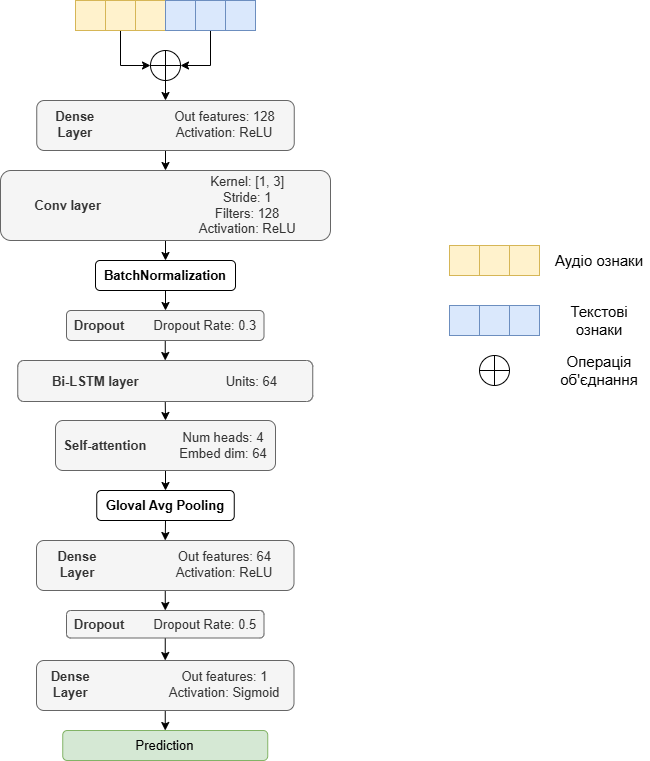
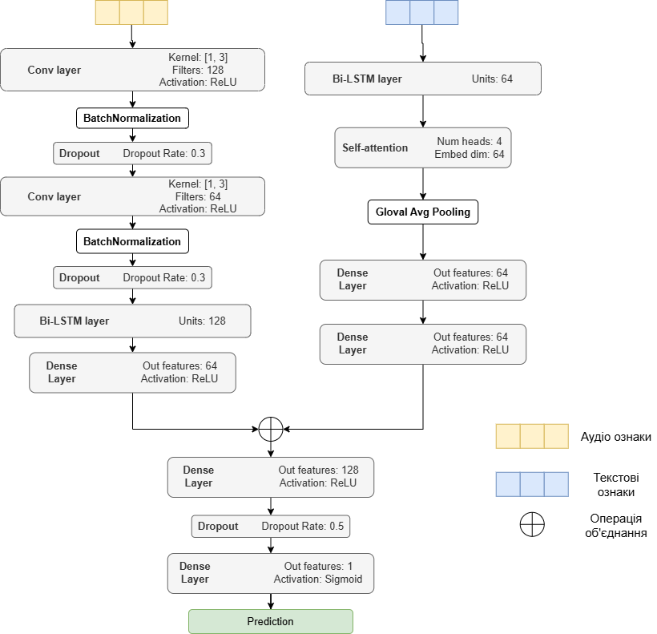

# Виявлення депресії шляхом мультимодального злиття інформації

Проєкт зосереджений на виявленні ознак депресії з використанням мультимодального підходу, який об’єднує аудіо та текстові дані з інтерв'ю. Було розроблено та оцінено дві архітектури нейронних мереж: моделі **раннього злиття** та **пізнього злиття**, які поєднують різні типи ознак для точнішого визначення ознак депресії.

## Огляд проєкту

Виявлення депресії є критично важливим для своєчасного втручання. У цьому проєкті досліджується використання мультимодальних даних — аудіо та тексту — для класифікації депресії. Комбінація цих двох модальностей дозволяє отримати повнішу інформацію про стан пацієнтів, ніж одномодальні моделі.

## Моделі

1. **Модель раннього злиття**:
   - Аудіо та текстові ознаки об'єднуються на початковому етапі, після чого проходять спільну обробку.
   - Архітектура використовує згорткові шари (CNN), двонаправлену LSTM (Bi-LSTM) та механізм самоуваги, що дозволяє моделі краще обробляти дані двох типів одночасно.

2. **Модель пізнього злиття**:
   - Аудіо та текстові ознаки обробляються окремо на початкових етапах і об’єднуються на завершальних етапах перед класифікацією.
   - Для кожної модальності використовуються окремі Bi-LSTM та CNN шари з подальшим об’єднанням, що дозволяє моделі враховувати специфіку кожного типу даних.

## Набір даних

Для дослідження використовувались **DAIC-WOZ** та **EDAIC-WOZ** набори даних, що включають аудіозаписи та транскрипти інтерв’ю, з анотаціями депресивного стану пацієнтів.

## Попередня обробка даних

- **Аудіо**: Аугментація через зміну тональності, зменшення шуму, сегментація, виділення ознак (MFCC, Mel-спектрограма та spectral contrast).
- **Текст**: Очищення тексту, аугментація через синоніми, обчислення ознак за допомогою TF-IDF.

## Оцінка

- Моделі оцінювались за метриками **точність, F1-міра, повнота та точність**.
- Модель раннього злиття показала найвищі результати на валідаційних даних, досягнувши F1-міри 0.93 для класу депресії, тоді як модель пізнього злиття досягла F1-міри 0.84.
- На тестових даних модель раннього злиття показала F1-міру 0.79 і загальну точність 0.86, підтверджуючи ефективність моделі.
